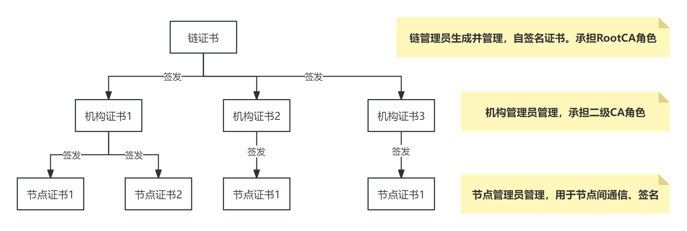
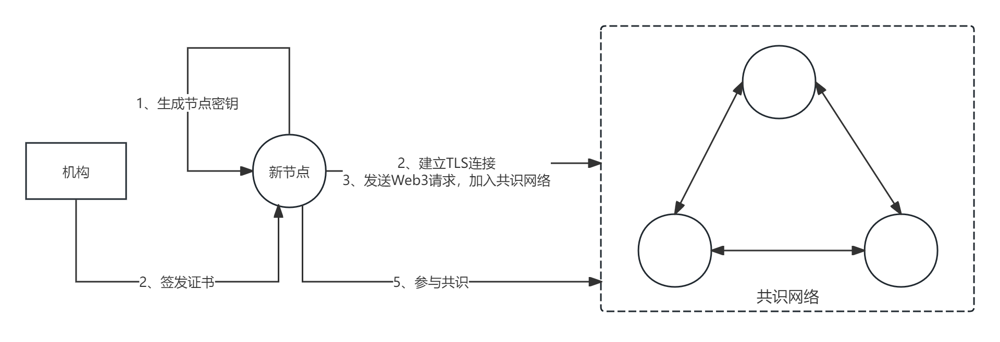

# CA机制

## 概述

天玄作为联盟链，需要一套完整的联盟准入机制，即加入通信网络并参与共识的节点必须是经过验证的联盟成员。因此，天玄使用了一套基于CA体系构建的联盟准入机制，该机制理论上支持任意多级的证书结构，保证了良好的扩展性。根据现有业务场景，目前采用三层证书体系：链证书→机构证书→节点证书。

其中，链证书 作为根证书，承担信任根的角色，由链管理员生成。一条联盟链唯一对应一个链证书，联盟链的所有节点都共享链证书，用于验证彼此证书的合法性。机构证书 由机构管理者持有，用于给隶属于该机构的联盟节点颁发证书。通过层级设计，减少链私钥的使用，提高CA体系的安全性。节点证书 由节点管理者持有，用于证明该节点公钥的合法性，在与其他节点建立安全通信和对消息进行签名验签的过程中必不可少。

在三层证书体系的基础上 一个新节点能够可控、安全的从生成密钥和证书，到与共识节点建立安全通信，再到经过共识加入共识网络、参与共识。

## 详细设计

### 三层证书体系

<figure><figcaption align = "middle">
图1. CA架构
</figcaption></figure>

三层模型中

1. 链证书 作为根证书，承担信任根的角色，由链管理员生成。链管理员维护着链私钥，实质上承担着Root CA的角色，负责给二级CA（即联盟中的各机构）颁发证书。

2. 机构证书 由机构管理者持有，用于给隶属于该机构的联盟节点颁发证书。机构管理者维护机构证书的私钥，实质上承担着二级CA的角色，负责给整个CA体系中的用户（即联盟中的各节点）颁发证书。通过二级CA分担根CA的职责，减少链私钥的使用，提高整个证书体系的安全性。同时，机构私钥的泄漏只影响该机构下属节点，对其他机构及节点没有影响。

3. 节点证书 由节点管理者持有，是节点身份的凭证，用于证明该节点公钥的合法性。节点证书 在与其他持有合法证书的节点建立TLS连接时必不可少。

当两个节点建立TLS连接时，需要校验双方证书的合法性，这一步主要由SSL握手协议完成。本质上就是以链证书作为信任根，验证 链证书→ 机构证书 →节点证书 这条证书链。验证过程需要从节点证书开始，链式向上验证证书，直到完成根证书的验证，过程如下：

<figure><figcaption align = "middle">
图2. TLS连接过程
</figcaption></figure>

### 天玄 CA 机制

在三级证书体系的基础上，进一步构建 CA 机制的整体架构如下：

<figure><figcaption align = "middle">
图3. 天玄CA
</figcaption></figure>

考虑一个新节点想要加入联盟网络，需要：

1. 生成节点公私钥及证书。其中，节点证书需由该节点所属机构签发
2. 新节点会主动与网络中已有节点建立TLS连接，建立连接的过程中需要提供节点证书（实际是证书链）用于建立双向认证
3. 通信连接建立后，新节点会主动向共识节点发送 Web3 请求，包含了节点自身的身份和公钥信息
4. 共识节点针对新节点的加入请求进行共识，共识达成后，将新节点的身份和公钥信息上链，共识节点列表完成更新
5. 新节点成功加入共识网络，可参与后续交易的共识
