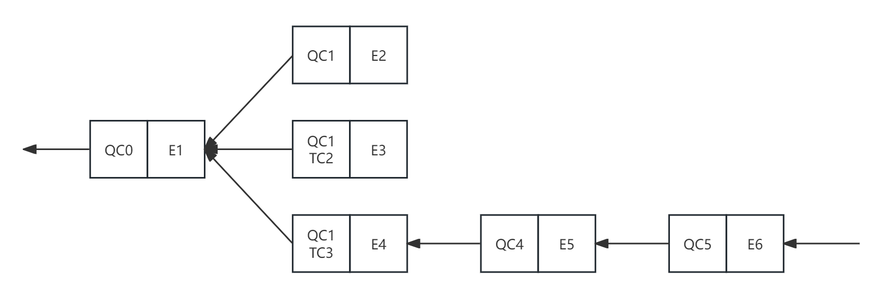

# 共识算法

## 概述

共识协议最早被使用在分布式容错系统当中，保证系统整体对外表现状态的一致性和活性。而区块链可以理解为一种拜占庭容错的分布式系统，区块链节点通过共识协议对输入的状态读写指令顺序达成一致，保证分布式系统执行指令顺序一致性，实现最终状态的一致性。其中，较为经典的共识算法簇 BFT，其思想基本已经作为区块链的共识算法的主流，被广泛应用在公链或联盟链当中。

在天玄架构中，同样使用 BFT 算法簇之一的 HotStuff 作为其中共识模块的实现基础。相比较与经典的 PBFT 协议，HotStuff 算法具备低消息复杂度，视图切换和常规共识流程的统一性。在 HotStuff 基础之上，天玄结合执行和共识流程对其进行了异步化改造，进一步提升了整体架构的性能表现。

## 详细设计

### 基础模型

考虑在 4 个节点的系统当中，系统以连续的 Round 向前推进运行。每个 Round 里面存在一个主节点负责提供发起提案，其他节点负责投票。投票的结果将会被发送给当前 Round 的主节点，投票及结果由主节点收集后生成一个投票证明（QC，QuorumCert），并发送给其他节点。如此往复，每个 Round 内对同一个提案投票三次，得到三个投票证明，则表明当前的提案已经在全网达成共识，一定会被每个诚实的节点提交。

具体，三轮投票的原则，第一轮目的是确认 "提案消息被接收" 。第二轮目的是确认 "全网都知道了提案消息被接收" 。第三轮目的是防止主节点失效后更换主节点的状态同步消息复杂度（即视图切换和常规共识流程的统一性），原理可见原始论文。

在上述的模型中，由于每个提案共识完成需要经历三轮投票。于是产生了，工程实现上的流水线优化流程。通过链式结构合并相同提案投票过程到不同提案投票过程中，如下：

    <figure style="display: inline-block; margin: 0;">
        
        <figcaption style="text-align: center; max-width: 1000px; font-weight: bold; font-size: 14px; margin-top: -20px; color: #555;">图1. HotStuff Chain</figcaption>
    </figure>

 在天玄实现中，【E】所代表的是共识事件 Event，由一系列交易集合组成，每一个事件都有一个 Round 轮次，该轮次是单独递增1；【QC】则是节点收消息后，投票内签名的集合或者生成的聚合前名，用来表示当前消息经过一定数量（BFT 系统当中，通常为系统节点数量的 2/3）的节点确认。流水线共识过程中，每次共识发起时，都会选择Round轮次最大的的【QuorumCert】包含在【Event】消息内 ，来进行下一轮次的共识。当有某个【E】经过连续三轮正常共识的共识后，如上图中【Round(E1) + 2 == Round(E2) + 1 == Round(E3)】时，则全网可以对E1 进行确认，即将状态变更持久化。

### 天玄共识流程

#### 常规流程

    <figure style="display: inline-block; margin: 0;">
        
        <figcaption style="text-align: center; max-width: 1000px; font-weight: bold; font-size: 14px; margin-top: -15px; color: #555;">图2. 共识流程</figcaption>
    </figure>

在核心的正常流程处理中，主要通过：

1. **Round**：事件处理
2. **ProcessProposalMsg**：提案消息处理
3. **ProcessVoteMsg**：投票消息处理

以上三个流程来实现共识

**Round事件处理**

每个节点会记录当前本地的 Round，当 QC 创建成功时，会进行 Round 推进，推进到下一个 Round ，来触发下一轮的 Event 提案。

过程中，通过当前 Round 数值来确定系统产生提案的节点（即 Leader 节点，通过 Round %  节点数量 来确定 ）。随后 Leader 节点从交易池中拉取交易集合，将其打包成【Event】。同事，从【HotStuff chain】中获取Round 值最大的 QC 作为 Parent Event ，然后向全网节点广播提案消息。

**ProcessProposalMsg**

当节点收到提案消息时，会通过该流程处理。其核心逻辑为：消息格式正确性校验，包括提案消息 Leader 签名、Round 计算、QC 验证等。消息校验通过后，节点使用 QC 推进本地的 Round ，即执行 Round + 1 。（节点使用 QC 推进 Round，所有节点适用）。

通过，QC 判断是否存在 Decide 的【Event】，如果有，则执行处于 Decide 阶段及其所有先驱节点进行共识提交（即持久化），并异步通知【共识处理流程】。

最后，在天玄中，还需要针对节点事件进行处理，当前是否存在节点加入、退出共识网络。

处理完成，将处理结果打包成投票消息，发送给 Round + 1 的新节点。

**processVoteMsg**

当进入到 Round + 1 时，新的 Leader 会收到来自 节点收集 来自 轮次为 Round 的节点投票消息。同样，对该消息进行一系列校验等，当收集达到 2/3 以上的投票消息时，则可以为上一个 Round 内的【Event】生成对应的 QC 。并使用 QC 推进到下一个 Round 。

#### 异常流程

    <figure style="display: inline-block; margin: 0;">
        
        <figcaption style="text-align: center; max-width: 1000px; font-weight: bold; font-size: 14px; margin-top: -15px; color: #555;">图3. 共识状态树</figcaption>
    </figure>

不同于 PBFT ，HotStuff 将视图切换流程和正常流程进行合并，即不再有单独的视图切换流程，从而降低了视图切(这里为 Round 切换)换的复杂度。因此，在 HotStuff 遭遇主节点不响应无法推进共识的情况下，进行 Round 切换时，系统中的某个节点也无需再对 "Round 切换" 共识后再通知新的主节点，它直接切换到新视图并通知新的主节点。HotStuff 把确认 "Round切换" 这一消息的行为放进了正常流程中。

核心实现还是通过 "Round 事件处理" ，在每一次成功推进 Round 时，都会为当前 Round 设置一个定时器。该定时器被设置一个超时时间，若再该时间段内，节点没有接收到任何有效消息（包括提案、投票消息) 。则认为当前系统失活，则进行超时处理 (本质上部分同步类的 BFT 是 Leader-based 模型，需要主节点进行提案驱动共识，当网络超时时，唯一的解决办法就是尝试更换主节点，当更换主节点成功，则恢复活性，也即在 GST 后保证活性）

**ProcessLocalTimeout，超时处理流程**

若当前 Round 超时，则针对当前 Round 序号进行签名，生成超时投票消息，并广播超时投票消息。若节点收到投票消息，则处理投票消息内签名，与常规共识处理投票流程相似，当收集达到 2/3 以上的投票消息时，生成对应的 TC（TimeoutCert，表示当前网络对网络超时达成共识）。

节点收到 TC 时，直接进行 Round 的推进。意味着，推进 Round 的方式有两种：
* QC 推进 Round + 1
* TC 推进 Round + 1

推进 Round 后，新 Round 内的主节点则继续进行新的【Event】打包发送提案消息。

因此，在实际的 HotStuff chain 中，它是一个树状的链式结构。如图 3 所示，如【E2】在指定时间内，没有共识完成。因此 Round 推进到 Round + 1 ，继续共识【E3】。同样，在指定时间内，也没有共识成功，则继续推进到 Round + 2 ，而【E4】处理成功了，则按照正常的链式处理。当处理到 QC5 时，其前驱节点【E1】满足存在三个连续的 QC ，则【E1】及其所有前驱也会进入 Decide 流程。

#### 链式同步

 从上面的流程中，我们知道，在 HotStuff 共识流程中，需要通过 HotStuff Chain 中，系统的 Round 号由当前最大的 QC 或 TC 来决定 ，新的提案【Event】的前驱【Event】。因此，在正常情况下，非 Leader 节点只会落后 Leader 节点一个最新的【QuorumCert】。在 Leader 节点将 Round + 1 的提案广播给全网节点时，会在提案消息【Event】内附带当前 QC Round 最大的 QC ，基于此构建链式的共识数据结构，而当非 Leader 再收到提案消息时，经过校验后，既可扩展自己的最长链。

然而，在一些特殊情况下，会存在某些节点会落后 Leader 节点相当轮次的情况。依然会按照最长链的拓展原则进行同步处理，推进本地节点的 Round。

当当前节点追赶上共识的 Round 后，便可正常加入网络参与共识。

#### 共识存储

为了从工程学上百分百保证 HotStuff 不会因为各种原因（例如宕机）而导致分叉出现。因此，节点在共识流程中，会将验证通过的【Event】或者【QuorumCert】都落盘。在发起投票前，也会将【Vote】 的请求落盘到共识存储中。当系统重启时，会将这些落盘的【Event】、【QuorumCert】以及【Vote】 从数据库中加载出来，构造当前 HotStuff Chain 的最新状态，然后根据最新的状态进入共识流程。当某个【Event】完成 Decide 流程后，会执行清除逻辑。

如图 3 的情况下，【E3】被提交，即执行 Decide 流程。在流程执行完成后，会将图中的【E3】的所有前置节点从共识存储中删除。

#### 共识切换

这里的 Epoch 指的是在相同的 Validator Set 下，执行共识集群。Epoch 从 0 开始，当集群接收到【节点注册/删除】的共识事件时，并且事件共识成功，则会发生 Epoch 切换。当 Epoch 发生变换时，会将当前还没有进入 Decide 阶段的事件重新发起共识。

### 异步化

 目前，基于BFT算法簇所实现的公链项目中，共识的过程既包括交易的顺序，也包括当前区块执行后的状态。意味着，共识开始前需要先执行区块中的所有的交易。那么在单链架构的情况下，如果需要将其 TPS 提升到【万】、【十万】、【二十万】时，会出现比较多的严重问题。BFT 协议为了保证活性，需要定时器去检测网络是否出现有效消息，否则就认为主节点失活。其一轮共识超时时间基本都是在 <mark>10 秒以内</mark>。因此，在每一轮共识打包的交易数量中，需要动态调整。而共识过程中，如果需要额外执行交易，并且其耗时也是不可精确预估，尤其是共识大批量交易的情况。

因此，天玄区块链引入了异步化的概念。核心在于上述【Hotstuff共识】中，只共识以 Event 为组织单位的交易序，即在【Hotstuff共识】流程中，不处理任何 Event 中的交易。待 Event 被共识成功后（即确序），再将确序的 Event 交由[通用流水线执行器](./execution-pipeline.md)来执行。执行完成后，对产生的执行后状态进行共识。

注：此处的共识每个正确的节点均有相同的输入，即执行后区块哈希，应使用可靠广播协议+签名验证即可。应注意 agreement 协议和 broadcast 协议的区别，见：https://decentralizedthoughts.github.io/2019-06-27-defining-consensus/。

