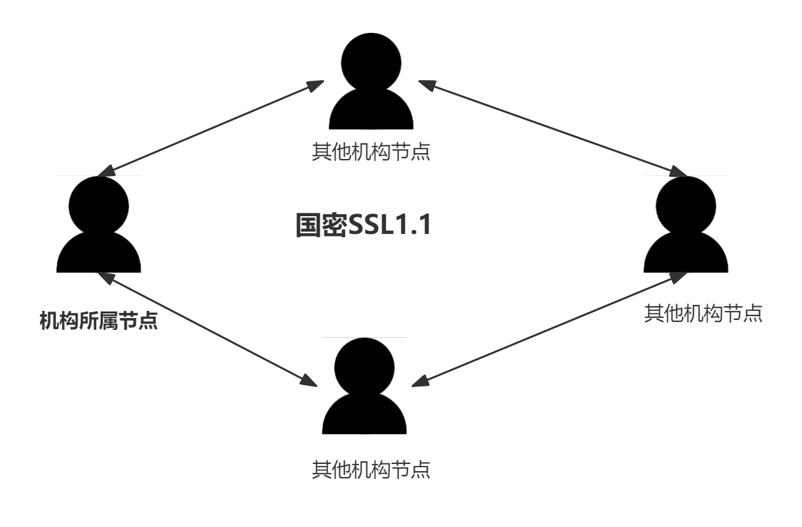

## 4.9.1. 概述

除了标准的加密算法，天玄链还充分支持国产密码学算法，基于[国产密码学标准](http://www.gmbz.org.cn/main/bzlb.html)，实现了国密加解密、签名、验签、哈希算法、国密 *SSL* 通信协议，对国家密码局认定的商用密码完全支持。

国密版天玄链将交易签名验签、*P2P* 网络连接、节点连接、数据落盘加密等底层模块的密码学算法均替换为国密算法，国密版天玄链与标准版主要特性对比如下：

|       | ECDSA 版天玄链           | EdDSA 版天玄链   | 国密版天玄链 |
| ------- | ------------- | ------------- | ------------- |
| SSL 链接 | Openssl TLSv1.2 协议     | TLSv1.3 协议 | 国密 TLSv1.1 协议       |
| 签名验证  | ECDSA 签名算法 | Ed25519 签名算法 | SM2 签名算法       |
| 消息摘要算法    | SHA-256 SHA-3 | SHA-256 SHA-3 | SM3 消息摘要算法       |
| 落盘加密算法    | AES-256 加密算法 | AES-256 加密算法 | SM4 加密算法       |
| 证书模式    | OpenSSL 证书模式 | OpenSSL 证书模式 | 国密双证书模式       |
| 合约编译器    | 以太坊 solidity 编译器 | 以太坊 solidity 编译器	 | 国密 solidity 编译器|

(注：国密算法 *SM2* , *SM3* , *SM4* 均基于国产密码学标准开发)
## 4.9.2. 系统框架
系统整体框架如下图所示：

    <figure style="display: inline-block; margin: 0;">
        
        <figcaption style="text-align: center; max-width: 1000px; font-weight: bold; font-size: 14px; color: #555;">图1. 天玄链密码框架</figcaption>
    </figure>

## 4.9.3. 国密SSL 1.1 握手建立流程
国密版节点之间的认证选用国密 *SSL 1.1* 的 *ECDHE_SM4_SM3* 密码套件进行 *SSL* 链接的建立，差异如下表所示：

|       | OpenSSL            | 国密SSL   |
| ------- | ------------- | ------------- | 
| 加密套件	 | 采用ECDH、RSA、SHA-256、AES256等密码算法     | TLSv1.3协议 | 
| PRF算法	  | SHA-256 | SM3 | 
| 密钥交换方式	    | 传输椭圆曲线参数以及当前报文的签名 | 当前报文的签名和加密证书| 
| 证书模式	    | OpenSSL证书模式	 | 国密双证书模式，分别为加密证书和签名证书 |

## 4.9.4. 数据结构差异
国密版与标准版天玄链在数据结构上的差异如下：

| 算法类型      | ECDSA 版天玄链            | EdDSA 版天玄链   | 国密版天玄链 |
| ------- | ------------- | ------------- | ------------- |
| 签名 | ECDSA (公钥长度: 512 bits, 私钥长度: 256 bits)	     | Ed25519 (公钥长度：256bits 私钥长度：256bits)	 | SM2 (公钥长度：512 bits, 私钥长度：256 bits)       |
| 哈希  | SHA3 (哈希串长度: 256 bits) | 	SHA3 (哈希串长度: 256 bits) | SM3 (哈希串长度: 256 bits)       |
| 对称加解密	    | AES (加密秘钥长度: 256 bits) | AES (加密秘钥长度: 256 bits) | SM4 (对称密钥长度: 128 bits)       |
| 交易长度	    | 520bits（其中标识符8bits,签名长度512bits） | 520bits (其中标识符8bits,签名长度512bits) | 1024bits (128字节，其中公钥 512bits ,签名长度 512bits )       |