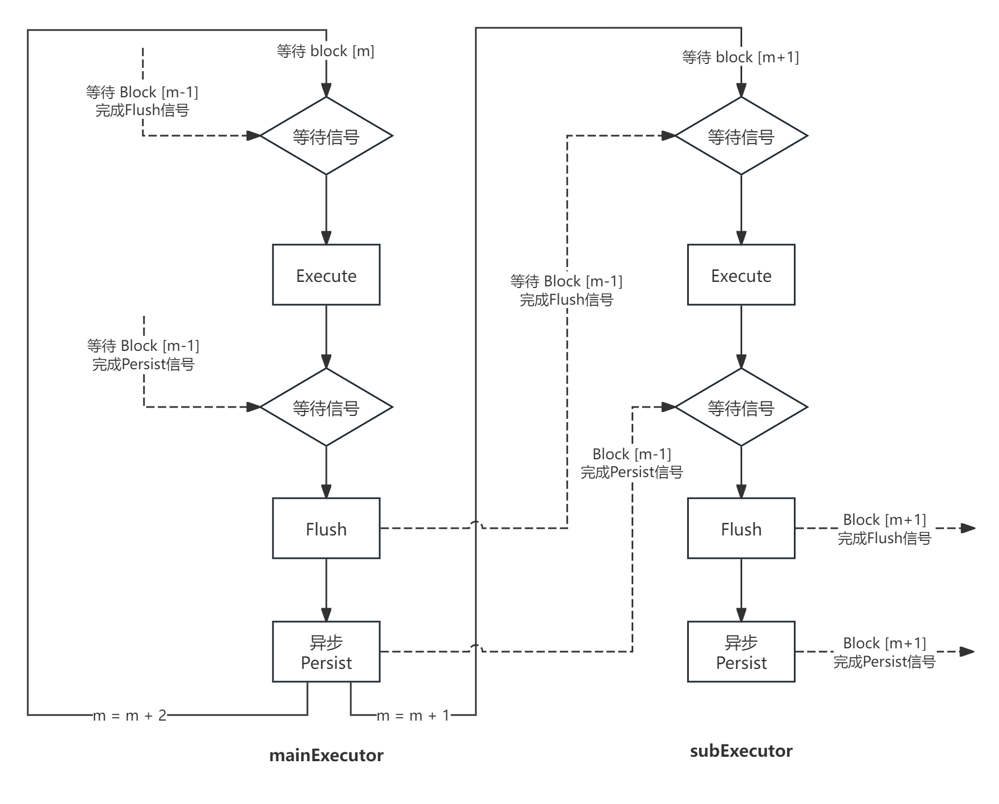

# 流水线执行

## 概述

区块链中，共识外的另一大性能瓶颈就是执行。主要原因是由于执行过程涉及到状态、区块链数据的持久化过程，该过程极度影响性能。为了将天玄的性能推到极致，在执行阶段针对执行、提交、持久化瓶颈进行流水线并行处理。

天玄中，重新定义了区块交易执行过程，分为了三个阶段。

1. Execute 执行，见并行执行小节；
2. Flush 刷盘，执行状态缓存刷盘到Level db缓存；
3. Persist 持久化，区块执行后状态持久化；

由此，一个区块的第一阶段(交易执行)，可以与上一个 block 的第二阶段以及第三阶段并行执行。

    <figure style="display: inline-block; margin: 0;">
        
        <figcaption style="text-align: center; max-width: 1000px; font-weight: bold; font-size: 14px; margin-top: -20px; color: #555;">图1. 执行流水线</figcaption>
    </figure>

## 流水线执行器

### 异步执行

天玄中的三个阶段，执行、刷盘阶段都在本地完成，而第三阶段持久化则需要通过共识完成，全网执行状态的确认再持久化。启用两个线程的流水线处理过程如下：

1. AsyncExecutor 在启动时，将启动两个线程来流水线处理所有定序的区块，分别为 mainExecutor 以及 subExecutor 。
2. mainExecutor 先获取当前需要待执行的已定序的共识负载（payload）并转为区块来执行，并等待唤醒信号，该信号来自于上一个区块的刷盘阶段执行完成。
3. 当上一个区块的刷盘阶段完成后，会唤醒当前区块，该区块会进行执行阶段。在执行阶段执行完成后，会进入刷盘阶段。同样在进入刷盘阶段前，会等待一个唤醒信号，该信号则是上一个区块的持久化阶段完成。
4. 当上一个区块的持久化阶段执行完成后，会继续唤醒当前区块，该区块会进行刷盘阶段。当刷盘阶段完成后，一方面通过异步队列，将该区块交由执行后状态的一阶段 BFT 共识，若该区块执行后状态共识成功，则会执行当前区块的持久化阶段，并主动唤醒下一个区块的持久化等待；另一方面，如果当前区块并非最新区块，即还存在下一个区块，则继续将该区块交由 subExecutor 执行上述逻辑，如此循环。如下：

    <figure style="display: inline-block; margin: 0;">
        
        <figcaption style="text-align: center; max-width: 1000px; font-weight: bold; font-size: 14px; margin-top: -20px; color: #555;">图2. 并行处理流程</figcaption>
    </figure>

### 执行后状态共识、持久化

其中 "异步Persist" 过程，则需要对区块执行后状态进行共识，从而到达完整的提交流程处理。具体实现流程见下：

1. 执行器按共识顺序执行 Event 交易，执行后生成区块并通知【GlobalStateVerifier】执行执行后状态全网验证。
2. 【GlobalStateVerifier】获取执行后待验证区块，委托【GlobalStateCoordinator】执行区块状态验证，并同步阻塞，直到当前区块验证、提交成功。
3. 【GlobalStateCoordinator】通过 P2P 网络将区块签名哈希及其签名广播全网节点。
4. 【GlobalStateCoordinator】收到同一区块状态的 2/3 节点的响应时，即认为当前区块执行后状态达成共识，否则则对区块进行回滚。根据结果通知【GlobalStateVerifier】执行。
5. 【GlobalStateVerifier】根据【GlobalStateCoordinator】结果执行相应的逻辑，提交或者回滚。
注：【GlobalStateCoordinator】本质上执行的是一个异步网络协议，可靠广播，不需要考虑超时处理情况，仅需要重试即可