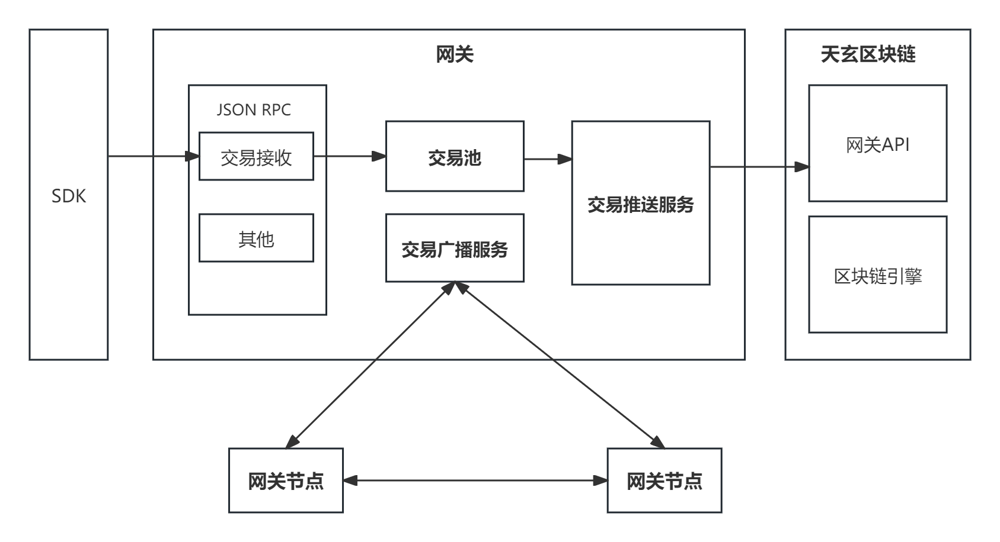

## 4.7.1. 概述

在天玄中，网关的主要任务是负责接收外部交易并缓存到交易池、使用 *P2P* 协议对加以进行广播、推送交易池中的交易到节点中进行共识、执行。

通常，完整的以太坊节点交易池、*P2P* 、共识节点网络一体，尤其是在大量交易等待验签、广播的场景下，交易不能得到充分传播，联盟链性能很容易受到约束。而抽象出网关单独处理验签、广播、交易池的工作能够提高交易的吞吐量，释放共识性能。

## 4.7.2. 详细设计

天玄网关可分为三个模块：

1. *JSON RPC* 服务。
2. 交易池服务。
3. 交易广播服务。

    <figure style="display: inline-block; margin: 0;">
        
        <figcaption style="text-align: center; max-width: 1000px; font-weight: bold; font-size: 14px; color: #555;">图1. 网关架构</figcaption>
    </figure>

### 4.7.2.1. JSON RPC

天玄 *JSON RPC* 是一套基于 *Jsonrpc4j* 提供的 *RPC* 服务，其遵循 *JSONRPC 2.0* 标准，主要提供区块链数据查询和交互的功能，详细的接口定义参考 [JSON-RPC API接口文档](../../app-development-manual/interface-list.md)

### 交易池

天玄网关交易池是一个生成者和消费者模型，由 *JSON RPC* 服务接收消费者交易，由广播和推送服务消费交易。基本模型如下：

    <figure style="display: inline-block; margin: 0;">
        
        <figcaption style="text-align: center; max-width: 1000px; font-weight: bold; font-size: 14px; color: #555;">图2. 交易池</figcaption>
    </figure>

交易池的主要工作包含：
* 对输入的交易进行签名验证。
* 缓存有效交易并推送广播。
* 推送交易到共识节点。其中，推送服务是一个由 GRPC** 实现的一个高速透传发送，可以将推送队列中的消息快速推送到天玄共识节点。*GRPC* 拥有压缩效率高，传输速率高等优点。

### 4.7.2.2. 交易广播服务

广播服务本质上是一个 *P2P* 网络，它由树状构造节点连接，收到消息后广播到根节点，由根节点快速广播到子节点。模型如下：

    <figure style="display: inline-block; margin: 0;">
        
        <figcaption style="text-align: center; max-width: 1000px; font-weight: bold; font-size: 14px; color: #555;">图3. P2P N 叉树交易池</figcaption>
    </figure>

模型中，所有节点以 *ID* 表示，从小到大排序后，组成树状网络。非根节点收到消息后推送根节点，然后由父推送给子节点依次完成推送。
