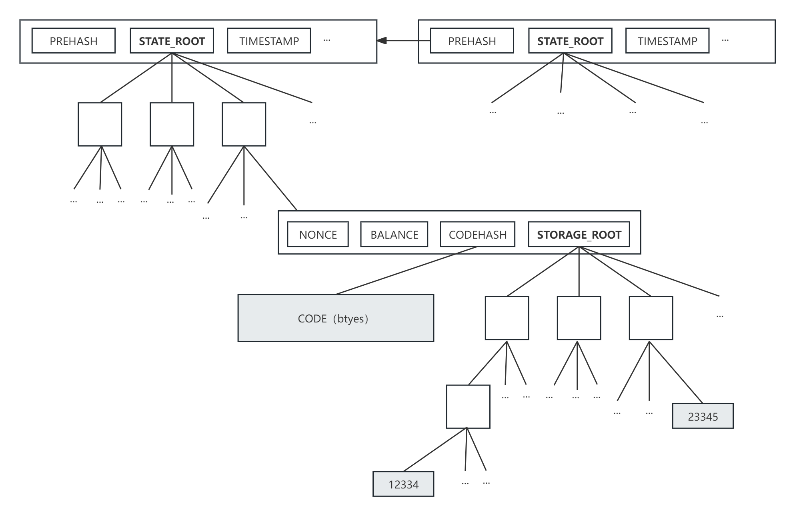
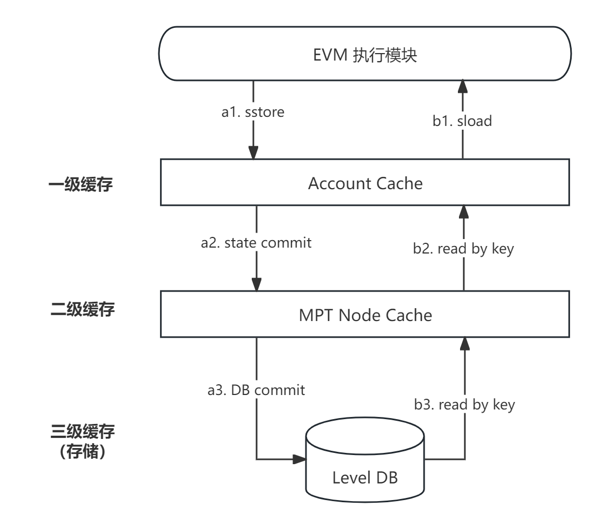
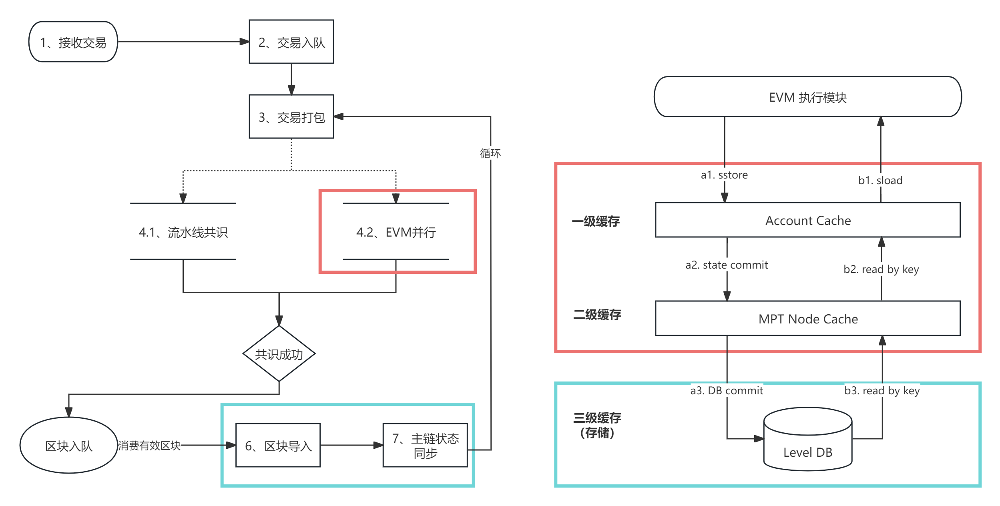

# 存储

## 概述

在传统公链架构中，核心的存储模型架构还是以MPT（默克尔压缩前缀树）的方式组织，目的是方便对状态提供存在性证明。使用MPT树能够最大程度上提供数据的存在性证明的情况下，减少树更新的计算次数。但对于联盟链来说，使用MPT树是一种性能的降低。在基于EVM的账户模型数据以及合约代码中数据的存取 ，其底层就是对MPT的CRUD操作。因此，树节点的读取可能会读取多次磁盘（根据树高以及节点的大小来决定读取次数），而一个节点的变更可能会引起MPT多次的裂变。

随着合约代码的存储数据越大，会导致EVM执行速度线性下降(生产环境中，以出现线性下降的情况)。而天玄中，通过去MPT的存储结构来解决随着状态数据的增加而导致 EVM执行速度线性下降的问题。
## 去MPT存储

### MPT 使用对比 

**优点**

* 性能相比于原来的方案会有所提升，提升率需要测试；

* 使链的共识性能保持稳定(前提是依赖的Level db 底层性能稳定，经过许多产品大量测试，表现稳定。详细的性能测试指标参考：http://www.lmdb.tech/bench/microbench/benchmark.html#:~:text=In%20order%20to%20test%20Leveldb's%20performance,%20we%20benchmark%20it%20against
* 使用去MPT方案后，状态变量的 读取可以加上缓存层，加快状态变量读取速度，从而提升EVM执行速度；

**缺点**

* 去MPT方案目前 只是能用于联盟链，无法使用于公链中。
* 目前只适用于强一致性共识算法。
* 目前只存储最新状态值，无法访问特定历史状态；

### 以太坊 MPT 树状态检索

在以太坊中，区块链全局状态被存储在MPT树中，这些全局状态通常指账户状态。而智能合约中的数据状态则是存在于智能合约账户的MPT子树中，即以账户维度管理合约数据。如下：

<figure><figcaption align="middle">
图1. 以太坊MPT存储
</figcaption></figure>

所有的状态两边都被抽象为KV键值对<storage key, value>。其中，storage key为MPT状态树中的唯一索引（压缩前缀树的索引方式），计算方式与EVM的存储布局有关。EVM以每32个字节为单位组织存储，被称为Slot，每个MPT树的叶子节点存储的就是该Slot的值，计算方式为：storage key = keccak256(bytes32(key) + bytes32(position)。当需要向MPT查询时需要自顶向下依次由storage key的字符指定的MPT路径，而在实际的实现中过程如下：

<figure><figcaption align="middle">
图2. 存储处理流程
</figcaption></figure>

**SSTORE（写入）：**

1. 将智能合约账户内的状态变量写入值写入一级缓存 Account cache。
2. 遍历 Account cache 中的数据，写入二级缓存 MPT cache 中。过程中，自底向上更新 MPT 树的叶子节点、中间节点，直至产生新的 MPT root 。
3. 共识完成，提交时在 commit 流程中将 MPT cache 中每个节点落盘到 Level db 中持久化。

**SLOAD（读取）：**

1. 根据智能合约地址读取，读取合约账户的状态子树。
2. 根据 storage key 读取向子树检索到存储 value 的叶子节点。

其中，依次先向缓存、db 读取。

### 天玄去MPT架构 

由于每次读写状态都需要对前缀树进行检索，严重影响联盟链场景下的执行效率。天玄直接使用哈希Map作为替代方案，每个<storage key, value>直接存储到哈希Map中，不通过MPT树检索。另外，为了区分不用合约账户的数据状态，确保数据状态的全局唯一性，storage key的计算方式变为：new storage key = sha3(account address+ storage key)。

天玄架构中，去MPT对整个架构的影响体现在两个部分

* 共识执行部分，发生对状态的读写工作。
* 状态的持久化工作

<figure><figcaption align="middle">
图3. 天玄处理流程
</figcaption></figure>

1. **EVM 指令执行**

**SSTORE**：直接使用对哈希Map的put(new storage key, value)，此处也不再需要更新数据状态所属合约的MPT子树、账户状态MPT树。

**SLOAD**：直接向缓存或db读取get(new storage key, value)，此处减少了读取账户状态MPT树、数据状态的子树。

2. **STATE COMMIT 实现**

 区块提交直接提交哈希Map中的数据，进行持久化即可，减少了存储MPT中间节点的开销。
