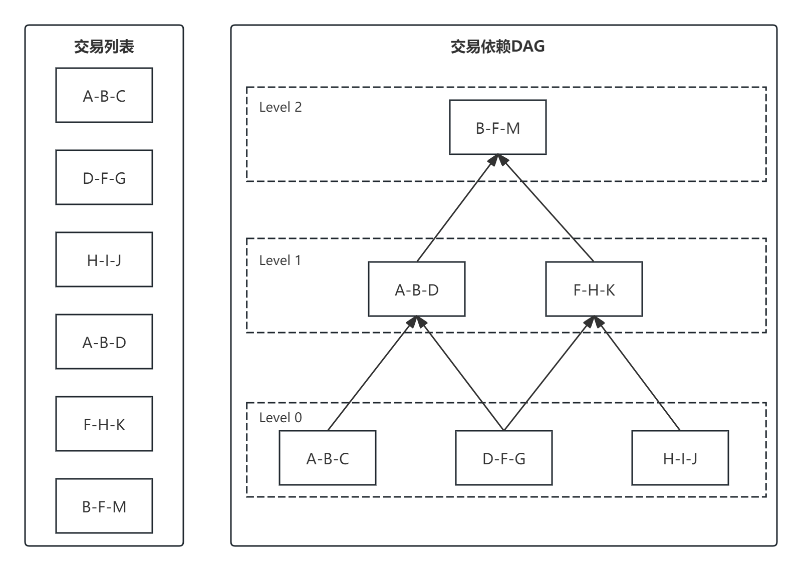
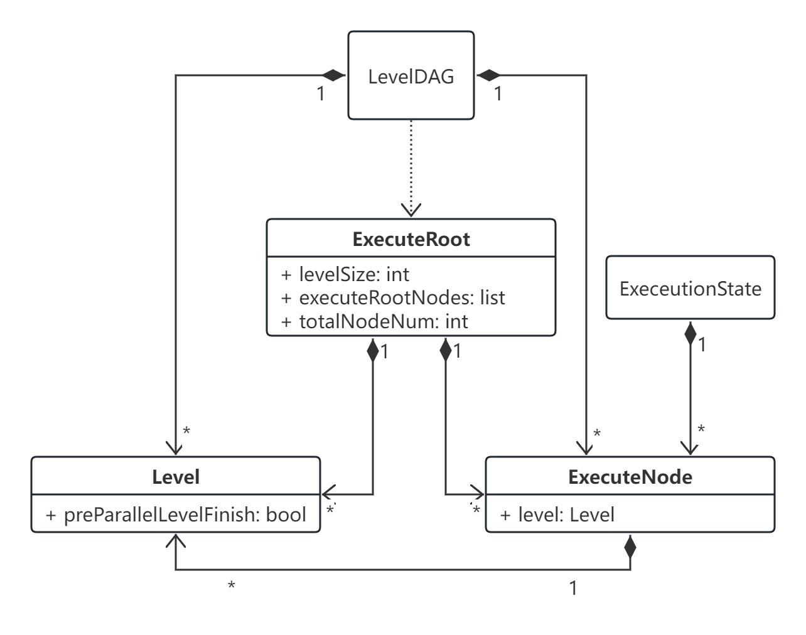

# 交易并行

## 概述

早期的区块链系统，其执行引擎都是一个串行执行模型，这种模型虽能保证执行的正确性，但却是区块链性能的一个核心瓶颈之一。天玄中，通过识别交易中的状态依赖，构建交易依赖图来对执行引擎进行并行化，从而提升交易执行速度，解决该瓶颈。

## 详细设计

### 通用 DAG 分析器

一个无环的有向图称做有向无环图（Directed Acyclic Graph），简称DAG图。在一批交易中，可以通过一定方法识别出每笔交易需要占用的互斥资源，再根据交易在Event中的顺序及互斥资源的占用关系构造出一个交易依赖DAG图，如下图所示，凡是同一Level （无被依赖的前序任务）的交易均可以并行执行。如下图所示，基于左图的原始交易列表的顺序进行拓扑排序后，可以得到右图的交易DAG:

<figure><figcaption align="middle">
图1. 交易DAG
</figcaption></figure>

核心结构：

<figure><figcaption align="middle">
图2. 核心结构
</figcaption></figure>

1. LevelDAG，会根据输入的可执行交易列表Txs，最大可并行执行层级（maxParallelLevel） 以及 最大层级深度（maxLevelDeep），生成可并行执行ExecuteRoot（Level0）。
2. ExecuteRoot，可并行执行根节点，该数据结构主要包含可并行执行的节点(List<ExecuteNode>)列表。换言之，并行执行器会并行执行ExecuteRoot 所对应的可执行节点(List<ExecuteNode>)集合。然后在依据当前Level 的执行状况，主动触发下一level层级所对应的可执行节点(List<ExecuteNode>)列表。
3. Level，当前层级数据结构抽象，主要用于控制最大可并行执行层级（maxParallelLevel） ，该参数可以这样理解，如当maxParallelLevel为1l时，即表明 当前执行level 必须要等待 Level -1 的所有执行可执行节点执行完成，才可以继续执行。。
4. ExecuteState ，执行状态抽象，对应 DAG 中的状态。

### 通用 DAG 执行引擎

该通用执行引擎的设计目的就是根据2.1 中通用DAG分析器所生成的ExecuteRoot，以固定的线程任务，最大并行度地执行交易，根据LevelDAG生成的 ExecuteRoot，并获取ExecuteRoot可并行执行节点列表parallelExecuteNodes，然后遍历该列表节点（ExecuteNode），将执行任务提交给线程池。

线程池会对ExecuteNode执行逻辑，具体流程如下：

1. 先判断节点所在的Level 的前一个Level是否执行完成，如果没有执行完成则加入待重试队列，交由待重试reactor线程后续轮循执行；否则，说明当前节点可以执行，则执行相应的交易方法（即可以时以太坊的智能合约交易，也可以是Java 的智能合约）。

2. 前置依赖节点执行完成，执行当前Level节点。

3. 当前Level每个节点执行完毕。将当前ExecuteNode所对应Level的待完成执行数减1（该标志为步骤1）中判定前置节点是否执行完成）.

4. 遍历当前ExecuteNode所对应的被依赖节点，并对被依赖节点执行移除前置依赖。若此时被依赖节点依赖关系节点数量为0，则对该节点执行步骤1）。如此递归，直到所有的节点被执行完成。