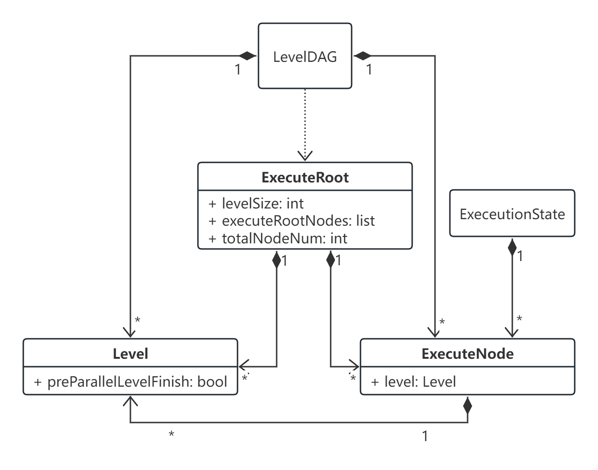

## 4.3.1. 概述

早期的区块链系统，其执行引擎都是一个串行执行模型，这种模型虽能保证执行的正确性，但却是区块链性能的一个核心瓶颈之一。天玄中，通过识别交易中的状态依赖，构建交易依赖图来对执行引擎进行并行化，从而提升交易执行速度，解决该瓶颈。

## 4.3.2. 详细设计

### 4.3.2.1. 通用 DAG 分析器

一个无环的有向图称做有向无环图（*Directed Acyclic Graph*），简称 *DAG* 图。在一批交易中，可以通过一定方法识别出每笔交易需要占用的互斥资源，再根据交易在 *Event* 中的顺序及互斥资源的占用关系构造出一个交易依赖 *DAG* 图，如下图所示，凡是同一 *Level* (无被依赖的前序任务) 的交易均可以并行执行。如下图所示，基于左图的原始交易列表的顺序进行拓扑排序后，可以得到下图的交易 *DAG* 。

    <figure style="display: inline-block; margin: 0;">
        
        <figcaption style="text-align: center; max-width: 1000px; font-weight: bold; font-size: 14px; color: #555;">图1. 交易DAG</figcaption>
    </figure>

核心结构：

    <figure style="display: inline-block; margin: 0;">
        
        <figcaption style="text-align: center; max-width: 1000px; font-weight: bold; font-size: 14px; color: #555;">图2. 核心结构</figcaption>
    </figure>

1. **LevelDAG**：会根据输入的可执行交易列表 *Txs* ，最大可并行执行层级（*maxParallelLevel*）以及最大层级深度（*maxLevelDeep*），生成可并行执行 *ExecuteRoot*（*Level-0*）。
2. **ExecuteRoot**：可并行执行根节点，该数据结构主要包含可并行执行的节点 (*List\<ExecuteNode>*) 列表。换言之，并行执行器会并行执行 *ExecuteRoot* 所对应的可执行节点 (*List\<ExecuteNode>*) 集合。然后在依据当前 *Level* 的执行状况，主动触发下一 *Level* 层级所对应的可执行节点(*List\<ExecuteNode>*)列表。
3. **Level**：当前层级数据结构抽象，主要用于控制最大可并行执行层级（*maxParallelLevel*），该参数可以这样理解，如当 *maxParallelLevel* 为 *1L* 时，即表明 当前执行 *Level* 必须要等待 *Level 1* 的所有执行可执行节点执行完成，才可以继续执行。
4. **ExecuteState**：执行状态抽象，对应 *DAG* 中的状态。

### 4.3.2.2. 通用 DAG 执行引擎

该通用执行引擎的设计目的就是根据 2.1 中通用 *DAG* 分析器所生成的 *ExecuteRoot* ，以固定的线程任务，最大并行度地执行交易，根据 *LevelDAG* 生成的 *ExecuteRoot* ，并获取 *ExecuteRoot* 可并行执行节点列表 *parallelExecuteNodes*，然后遍历该列表节点（*ExecuteNode*），将执行任务提交给线程池。

线程池会对 *ExecuteNode* 执行逻辑，具体流程如下：

1. 先判断节点所在的 *Level* 的前一个 *Level* 是否执行完成，如果没有执行完成则加入待重试队列，交由待重试 *reactor* 线程后续轮循执行。否则，说明当前节点可以执行，则执行相应的交易方法（即可以是以太坊的智能合约交易，也可以是 *Java* 的智能合约）。

2. 前置依赖节点执行完成，执行当前 *Level* 节点。

3. 当前 *Level* 每个节点执行完毕。将当前 *ExecuteNode* 所对应 *Level* 的待完成执行数减 1（该标志为步骤 1）中判定前置节点是否执行完成）.

4. 遍历当前 *ExecuteNode* 所对应的被依赖节点，并对被依赖节点执行移除前置依赖。若此时被依赖节点依赖关系节点数量为 0 ，则对该节点执行步骤 1）。如此递归，直到所有的节点被执行完成。