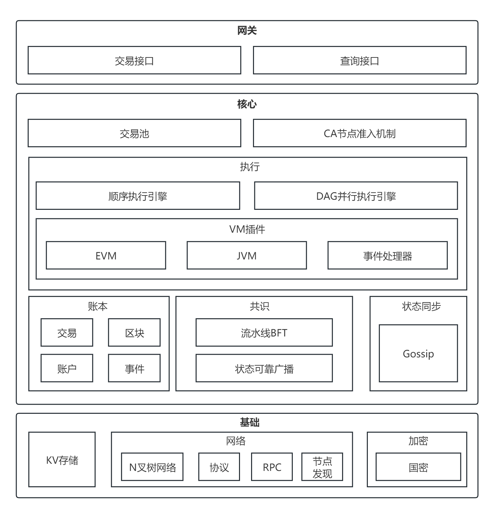

# 整体架构

## 概述

天玄区块链引擎使用模块化方式进行设计，方便对各个模块进行插拔和兼容。整体架构自下而上，天玄划分成基础层、核心层和网关层。

    <figure style="display: inline-block; margin: 0;">
        
        <figcaption style="text-align: center; max-width: 1000px; font-weight: bold; font-size: 14px; color: #555;">图1. 整体架构</figcaption>
    </figure>

* 基础层：提供天玄引擎基础的存储、*P2P* 网络、加密等模块和算法库。
* 核心层：实现区块链的核心功能和逻辑，分为两部分
  * 区块链核心层，提供区块链特征的数据结构、交易执行引擎和账户存储驱动
  * 互联核心层：实现区块链的基础 *P2P* 网络通信、共识机制和区块同步机制
* 网关层：面向区块链用户，提供交互的 *RPC* 接口、*SDK* 和控制台

## 核心模块

### 共识算法

天玄实现了可大规模扩展的 *HotStuff* 算法，并对其进行异步化改进升级，实现了更高性能的吞吐量和处理速度。在单链架构中，天玄将执行和共识过程分离，实现流水线共识、执行的异步化，进一步突破了单链的性能瓶颈。

### P2P网络

天玄实现了 *Gossip* 协议，提供了高效、通用、安全以及节点发现的网络通信基础功能，支持区块链消息的 *RPC* 调用，单播和全局广播。

### 加密机制

天玄充分支持国产密码学算法，基于[国产密码学标准](http://www.gmbz.org.cn/main/bzlb.html)，主要包括国密 *TLSv1.1* 协议、*SM2* 签名算法、*SM3* 消息摘要算法、*SM4* 加密算法、国密双证书模式、国密 *Solidity* 编译器。

### 执行引擎

天玄的可插拔执行模块目前支持 *EVM* 、*JVM* 两种执行引擎。并且针对串行效率问题构建交易执行依赖的 *DAG* 图，实现了线性序等价的并行执行。

### 存储模型

天玄针对联盟链场景，对存储模型进行了优化，去除了 *MPT* 树的索引结构，减少了在执行是对 *MPT* 树的检索。底层使用 *LevelDB* 作为持久化存储引擎，以支持海量数据。

### 身份认证

天玄采取集中式认证体系。为联盟链构建了三级的 *CA* 准入机制：【链证书 → 机构证书 → 节点证书】，分别对三个级别的组织、机构的加入和退出提供验证功能。
