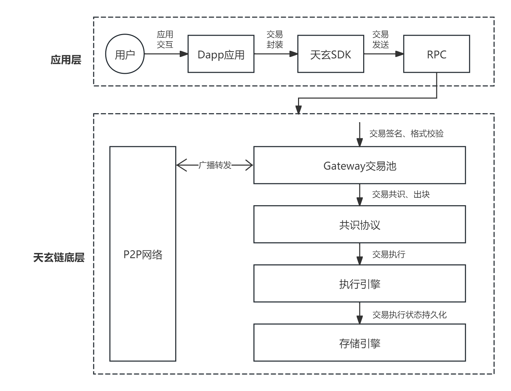

# 天玄链交易流程

## 概述

在天玄中，智能合约是一段完整的业务代码，其中定义了对区块链数据状态读写的规则。而交易则是用户发起对智能合约程序的调用，实现对数据状态的变更媒介，其记录了区块链中数据状态发生变化的一切。交易的执行过程反映了用户在区块链上的活动，也是区块链系统的主要工作。

天玄区块链的交易流程主要分为四个步骤：

1. 交易发起
2. 交易共识
3. 交易执行
4. 状态变更持久化

    <figure style="display: inline-block; margin: 0;">
        
        <figcaption style="text-align: center; max-width: 800px; font-weight: bold; font-size: 14px; color: #555;">图1. 交易流程</figcaption>
    </figure>

## 交易流程

### 1. 交易发起 

当用户与应用客户端交互式，发生了区块链状态变更的操作，客户端需要通过天玄 *SDK* 构造一笔带用户签名的有效交易，以在区块链中执行这些状态变更。该笔交易包含：

* **交易发起地址**：代表用户发起交易的地址（通常指公钥地址）。

* **交易的主要内容**：待执行的智能合约代码（执行状态变更的主要内容）。

* **交易接收地址**：通常指交互的智能合约地址。在联盟链中，交易分为两类，其一是部署合约交易；其二是合约调用交易。前者不指定地址，后者指定已部署的合约地址。

* **交易签名**：使用的代表用户身份的地址产生的签名，以便天玄对交易进行验证，目的是防止伪造交易。

* **其他交易校验数据**：具体可参见[交易数据说明文档](./data-structure-and-encoding.md#交易数据ethtransaction)。

当客户端完成交易封装，则选择一个 *RPC* 节点，将交易发送至 *RPC* 节点。

### 2. 交易共识 

当 *RPC* 节点接收到交易时，先进入交易池进行交易的预处理，再进行具体的共识排序、出块。具体如下：

#### Gateway交易池处理

*Gateway* 之前需要对交易交易进行去重、签名验证。前者目的是在交易池的广播过程中去除重复的交易，减少广播重复交易的带宽消耗和计算消耗。后者的目的是验证交易签名的有效性。若不合法或者重复交易产生，将会被直接丢弃，不进入交易池。若合法则会通过 *P2P* 网络对交易进行广播，让交易尽可能到达所有节点。

#### 共识处理

当交易被缓存到 *Gateway* 中时，共识模块会定时从交易池中拉去一定数量的交易进行排序（如按照 *FIFO* 原则排序）。按照区块数据说明文档，将该批次的交易进行封装，再由共识协议对区块进行共识。在联盟链中，共识协议仅承担排序的作用，目的是通过两阶段或者三阶段的广播让全网达成某个高度 *h* 的区块为 *b* 的共识，即 *\<h，b>* 在每个节点的试图上必须一致。

### 3. 交易执行 

在节点对区块完成共识后，按照共识顺序，将被执行引擎按照区块为单位进行交易的批次执行。

通常，区块链系统的运行被抽象为状态机，按照基于相同的初始状态开始，执行相同顺序的状态读写日志（即，交易），最终会到达相同的状态原则，一般会采用串行执行模型保证区块链状态的一致。在天玄中，交易执行采用了并行执行引擎。因此，通过开发者指定的依赖构造交易的依赖图，即 *DAG* 图，再根据 *DAG* 节点依赖关系对交易进行并行执行。

为保证并行执行的正确性，防止任何外部的行为导致的状态不一致，执行的过程存在两条路径：

1）快速路径，基于开发者指定的交易依赖构建 *DAG* 图，并执行成功。

2）串行慢速路径，若并行执行冲突，说明 *DAG* 构造存在问题，在当前区块回退到串行执行，保证执行后状态的一致性。

### 4. 状态变更持久化 

在执行完成后，持久化内容分为两部分：
* 状态持久化
* 区块等交易执行回执持久化

同时，通知交易池剔除已经执行完成的交易。
