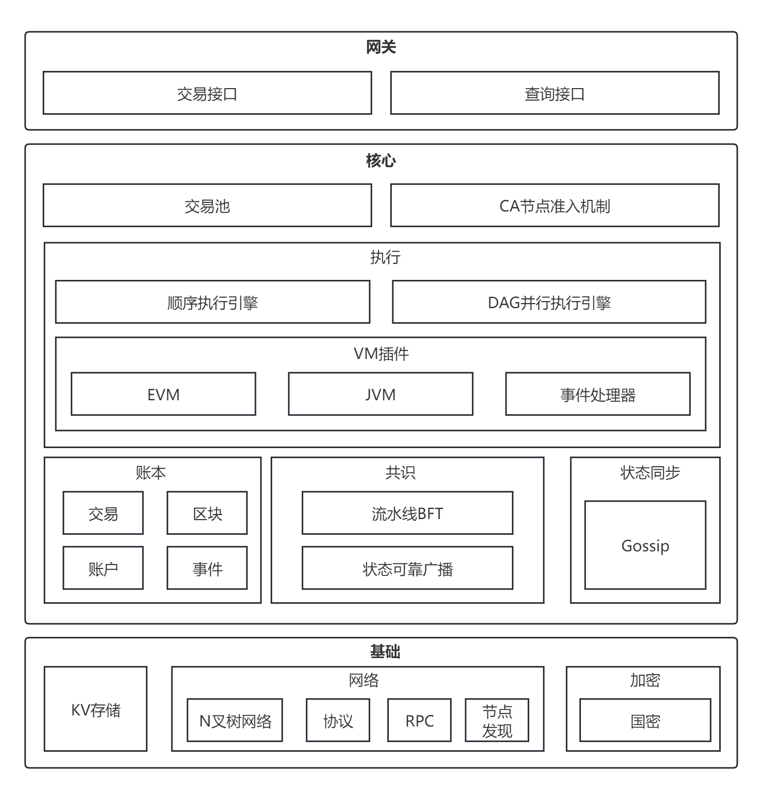

# 天玄区块链

天玄链以联盟链的实际需求为出发点，兼顾性能、安全、可运维性、易用性、可扩展性，支持多种 *SDK* ，并提供了可视化的中间件工具，大幅缩短建链、开发、部署应用的时间。

此外，天玄链通过信通院可信区块链评测功能、性能两项评测，单链 *TPS* 可达 30w 以上。

## 关键特性

|                                              |                             |
| -------------------------------------------- | --------------------------- |
| <mark style="color:blue;">**整体架构**</mark>    | 
 
                 |
| 架构模型                                         | 双层全分片架构                     |
| 并行计算                                         | 支持块内交易并行执行                  |
| 节点类型                                         | 共识节点                        |
| 计算模型                                         | 排序-执行-验证                    |
| 系统性能                                         |                             |
| 峰值TPS                                        | 百万级                   |
| 交易确认时延                                       | 秒级                          |
| <mark style="color:blue;">**硬件推荐配置**</mark>  | 
 
                 |
| CPU                                          | 2.4GHz \* 32/64核            |
| 内存                                           | 64GB                        |
| 存储                                           | 4TB                         |
| 网络带宽                                         | 100Mb                       |
| <mark style="color:blue;">**账本模型**</mark>    | 
 
                 |
| 数据结构                                         | 链式结构，区块通过哈希链相连              |
| 是否分叉                                         | 不分叉                         |
| 记账类型                                         | 账户模型（非 UTXO）                 |
| <mark style="color:blue;">**共识算法**</mark>    | 
 
                 |
| 共识框架                                         | 可插拔设计                       |
| 共识算法                                         | 双层异步 BFT 算法                   |
| <mark style="color:blue;">**存储引擎**</mark>    | 
 
                 |
| 存储设计                                         | 支持 k-v                        |
| 引擎类型                                         | 支持 RocksDB                   |
| <mark style="color:blue;">**网络协议**</mark>    | 
 
                 |
| 节点间通信                                        | P2P 协议                       |
| 客户端与节点通信                                     | JsonRPC，Channel 协议           |
| <mark style="color:blue;">**智能合约**</mark>    | 
 
                 |
| 合约引擎                                         | 支持 Solidity 和预编译合约            |
| 引擎特点                                         | 图灵完备，沙盒运行                   |
| <mark style="color:blue;">**密码算法和协议**</mark> | 
 
                 |
| 国密算法                                         | 支持                          |
| 国密SSL                                        | 支持                          |
| 哈希算法                                         | Keccak256、SM3               |
| 对称加密算法                                       | AES、SM4                     |
| 非对称加密算法                                      | ECDSA、SM2、ED25519           |
| 非对称加密椭圆曲线                                    | Secp256k1、Sm2p256v1         |
| <mark style="color:blue;">**安全控制**</mark>    | 
 
                 |
| 存储安全                                         | 支持落盘数据加密存储                  |
| 通信安全                                         | 支持全流程 SSL                    |
| 准入安全                                         | 基于 PKI 身份认证体系                 |
| 证书管理                                         | 支持证书颁发、撤销、更新                |
| 权限控制                                         | 支持细粒度权限控制                   |
| <mark style="color:blue;">**隐私保护**</mark>    | 
 
                 |
| 隐私保护协议                                       | 支持群签名、环签名、同态加密              |
| 场景化隐私保护机制                                    | 基于支持隐匿支付、匿名投票、匿名竞拍、选择性披露等场景 |
| <mark style="color:blue;">**开发支持**</mark>    | 
 
                 |
| 开发建链工具                                       | 一键搭链脚本                      |
| SDK语言                                        | Java                        |
| <mark style="color:blue;">**运维支持**</mark>    | 
 
                 |
| 运维建链工具                                       | 企业级联盟链部署工具                  |
| 可视化数据展现                                      | 区块链浏览器                      |
| 动态管理节点                                       | 支持动态新增、剔除、变更节点              |
| 数据备份与恢复                                      | 提供数据导出与恢复服务                 |

## 架构

<figure><figcaption></figcaption></figure>

在非分片架构下，共识网络使用<mark>异步流水线 *BFT* </mark>和<mark>完全 *N* 叉拓扑网络</mark>实现**每秒 10\~30 万**的交易序列确认。解决了复杂交易执行耗时长导致的网络抖动以及单节点广播速度慢等问题。而后通过<mark>通用 *DAG* 状态分析器</mark>和<mark>并行执行引擎</mark>对已确序交易进行快速执行。最后再通过<mark> *Verfiy_BFT* 算法</mark>实现共识状态的快速变更。

技术亮点总结如下：

* **异步流水线 *BFT* + 完全 *N* 叉拓扑网络**：实现高效稳定的共识算法 (共识算法可插拔组件化)
* **通用 *DAG* 状态分析器 + 并行执行引擎**：可以使交易执行器最大并行度执行任意交易集合
* ***Assembly-VM***：实现支持 *Solidity* 与 *Java* 语言的 *Evm* 和 *Jvm*
* **多种加密套件**：支持国密套件 (包括 *TLS* ，签名以及加密等功能)

## 安全性

考虑到联盟链的高安全性需求，除了节点之间、节点与客户端之间通信采用 *TLS* 安全协议外，天玄链还实现了一整套安全解决方案：

* **网络准入机制**：限制节点加入、退出联盟链，保障了系统安全性
* **支持国密算法**：支持国密加密、签名算法和国密通信协议
* **落盘加密方案**：支持加密节点落盘数据，保障链上数据的机密性

## 性能

为提升系统性能，天玄从存储优化，共识效率提升以及交易并发执行这几个方面进行了优化，使得交易处理性能最高达到十万级以上：

* **状态存储去 *MPT* 结构，采用 *k-v* 存储**：去除 *MPT* 结构，使得存储和访问的效率更高
* **共识与执行分离**：将执行从共识流程中抽离，只对交易定序进行共识，使共识过程更加快速稳定
* **交易并行执行**：基于 *DAG* 算法根据交易间互斥关系构建区块内交易执行流，最大化并行执行区块内的交易。交易生命周期的异步并行处理：共识、同步、落盘等各个环节的异步化以及并行处理

## 易用性

天玄区块链引入开发部署工具、区块链浏览器等工具来提升系统的易用性，大幅缩短建链以及应用部署的时间：

* **开发部署工具**
* ***SDK***（天玄目前只支持 *Java SDK*）
* **区块链浏览器**

