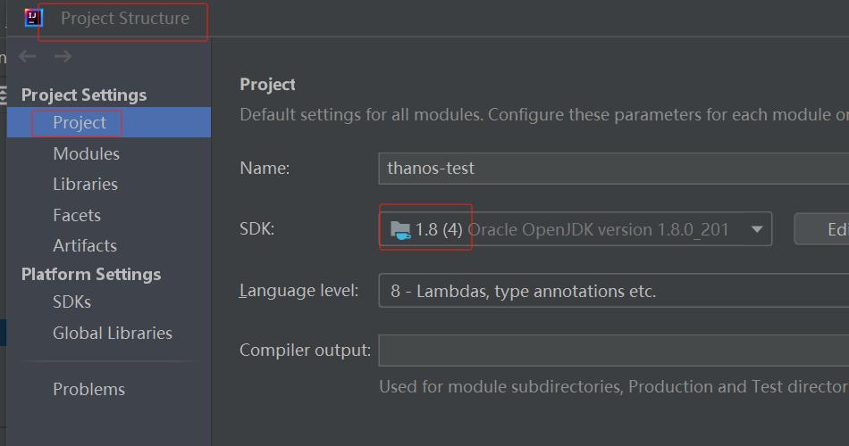
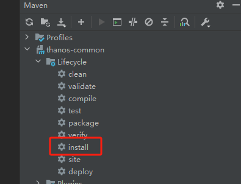

# 应用部署示例

在开始本教程前，请先确保已经按照 [快速搭建天玄链](depoly-tianxaun-chain/) 在服务器上部署好了一条测试链。

本教程将在 <mark>*Windows*</mark> 环境下，使用 *IntelliJ IDEA* 进行，方便读者基于此 *Demo* 进行开发，所以请确保在运行 *Demo* 代码的机器上具备以下环境。

* **IDE：**进入 [*IntelliJ IDEA* 官网](https://www.jetbrains.com/idea/download/) ，下载并安装社区版 *IntelliJ IDEA*
* **Oracle JDK：**Java应用需要依赖 [*Oracle JDK*](https://www.oracle.com/java/technologies/javase/javase8-archive-downloads.html) ，且jdk版本不低于 1.8.0u201
* **Maven：**项目需要依赖 [*Maven*](https://archive.apache.org/dist/maven/maven-3/3.3.9/) ，且版本不低于 3.3.9

## 下载Demo物料包

从 *GitHub* 上下载 *Demo* 示例代码，该示例代码会使用天玄的 *Web3j SDK* 与天玄链交互，模拟部署应用合约并向合约发起交易。

由于依赖的 `thanos-web3j.jar` 还未发布到 *Maven* 公共库，所以当前阶段也需要手动安装一下，同样 *thanos-web3j* 依赖的 *thanos-common* 也是。以确保在本地机器的 *Maven* 本地仓库中构建完整的依赖。

```sh
git clone https://github.com/TianXuan-Chain/thanos-package-generate.git
git clone https://github.com/TianXuan-Chain/thanos-common.git
git clone https://github.com/TianXuan-Chain/thanos-web3j.git
git clone https://github.com/TianXuan-Chain/thanos-demo.git
```

## 配置 IntelliJ IDEA <a href="#id2.2-bu-shu-di-yi-ge-tian-xuan-ying-yong-pei-zhi-maven-he-jdk" id="id2.2-bu-shu-di-yi-ge-tian-xuan-ying-yong-pei-zhi-maven-he-jdk"></a>

配置 *JDK*。

<div align="left">

<figure><figcaption></figcaption></figure>

</div>

配置 *Maven*。

<div align="left">

<figure><figcaption></figcaption></figure>

</div>


## 编译 thanos-common

首先，由于 *thanos-common* 依赖于 `bctls-gm-jdk15on.jar` 文件，所以请先下载好的物料包中找到 `thanos-package-generate/dependenies/jar/bctls-gm/bctls-gm-jdk15on.jar` 文件。也可以直接在此处获取：[bctls-gm-jdk15on.jar 文件下载](https://github.com/TianXuan-Chain/thanos-package-generate/blob/main/dependencies/jar/bctls-gm/bctls-gm-jdk15on.jar)

然后执行下面命令将其加载到本地 *Maven* 仓库中。

```sh
mvn install:install-file -Dfile=bctls-gm-jdk15on.jar -DgroupId=org.bouncycastle -DartifactId=bctls-gm-jdk15on -Dversion=0.1 -Dpackaging=jar
```

最后，使用 *IntelliJ IDEA* 打开 *thanos-common* 项目，按照下图所示执行 `maven install`（也可以直接在 *cmd* 中执行）。

<div align="left">

<figure><figcaption></figcaption></figure>

</div>

编译执行成功后，`thanos-common.jar` 会被加载到本地仓库中。

## 编译 thanos-web3j

使用 *IntelliJ IDEA* 打开 *thanos-web3j* 项目，执行 `gradle publishToMavenLocal` （如果本地安装了 *gradle* ，也可以通过 *cmd* 执行）。

<div align="left">

<figure><figcaption></figcaption></figure>

</div>

执行成功，`thanos-web3j.jar` 将会被加载到本地 *Maven* 库中。

## 运行 Demo 应用代码 <a href="#id2.2-bu-shu-di-yi-ge-tian-xuan-ying-yong-yun-xing-demo-ying-yong-dai-ma" id="id2.2-bu-shu-di-yi-ge-tian-xuan-ying-yong-yun-xing-demo-ying-yong-dai-ma"></a>

使用 *IntelliJ IDEA* 打开 *thanos-demo* 项目，配置 *Maven* 和 *JDK* ，注意 *Maven* 本地仓库路径需要和打包 *thanos-web3j* 时的 *Maven* 本地仓库路径一致。

而后根据自己部署的测试链 *ip* 和 *port* 修改 `thanos-web3j.conf` 配置文件。

```editorconfig
gateway = {
    # List of gateway peers to send msg
    rpc.ip.list = [
        #"127.0.0.1:8082"
        #"10.246.199.210:8182"
        #"127.0.0.1:8082","127.0.0.1:8182"
    ]
        web3Size = 3
        #connection check interval (s)
        checkInterval = 60

    # List of gateway peers http port to send msg
    http.ip.list = [
        #"127.0.0.1:8200"
        "101.35.234.159:8580"
    ]
}

resource {
 #   logConfigPath = "F:\\myJava\\blockchain3.0\\thanos-web3j\\src\\main\\resources\\logback.xml"
}

#tls settings, such as path of keystore,truststore,etc
tls {
    needTLS = false
    keyPath="F:\\myJava\\blockchain3.0\\thanos-gateway\\src\\main\\resources\\ec-tls2\\node.key"
    certsPath="F:\\myJava\\blockchain3.0\\thanos-gateway\\src\\main\\resources\\ec-tls2\\chain.crt"
}

#crypto settings, such as signECDSA, getHash, etc
crypto {
	#JCA cryptoprovider name.
	providerName="SC"
	#JCA sign Algorithm,such as ECDSA, ED25519 etc
	sign.algorithm="ECDSA"
	#sign.algorithm="ED25519"
	#sign.algorithm="SM"
	#Used for create JCA MessageDigest
	hash.alg256="ETH-KECCAK-256"
	hash.alg256="ETH-KECCAK-256-LIGHT"
	hash.alg512="ETH-KECCAK-512"
}
```

配置信息如下：

* **gateway**： *SDK* 和天玄链节点网关交互的相关配置
* **resource**： 日志的路径配置
* **tls**： 是否开启 *tls* 以及 *tls* 相关的证书和私钥的配置 (当前默认关闭，是否开启需要和节点的配置保持一致)
* **crypto**： 加密相关配置

当前教程，只需要将自己的 *http* 链接配置到 *http . ip . list* 中即可。如果按照之前教程部署的链，没有修改过默认端口，则直接修改为<mark>节点服务器 *ip* : 8580</mark> 即可。

或者请查询节点网关的配置文件 `thanos-gateway.conf` 中所设置的端口号，更多信息请见：[网关配置说明](../installation-manual/tianxaun-gateway/configuration.md#主配置文件-thanos-chainconf)。

配置完成并加载 Maven 依赖后运行 *SimpleTokenHttpTest.main* 。

<div align="left">

<figure><figcaption></figcaption></figure>

</div>

该方法会使用 *thanos-web3j* 模拟部署一个简单的 *Token* 应用到测试链上，并模拟执行 *Token* 转移交易。成功运行后，等待片刻，你会看到如下信息

<div align="left">

<figure><figcaption></figcaption></figure>

</div>

返回应用合约地址，表明合约部署成功，后面的 *transder from* 以及 *transfer to* 等信息是模拟执行的合约交易结果。

想了解更多关于 *Web3j SDK* 的使用细节，请参考：[Java SDK](../app-development-manual/java-sdk/README.md)
