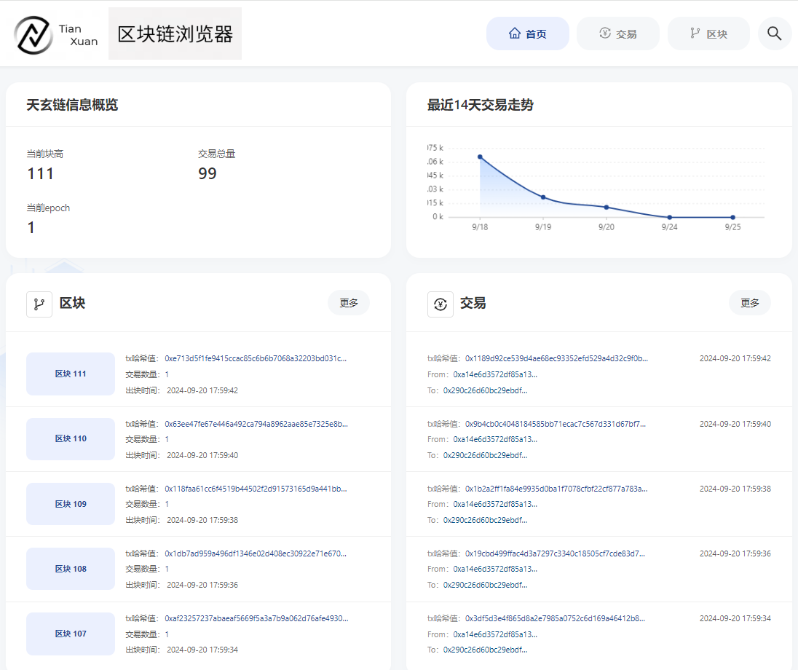
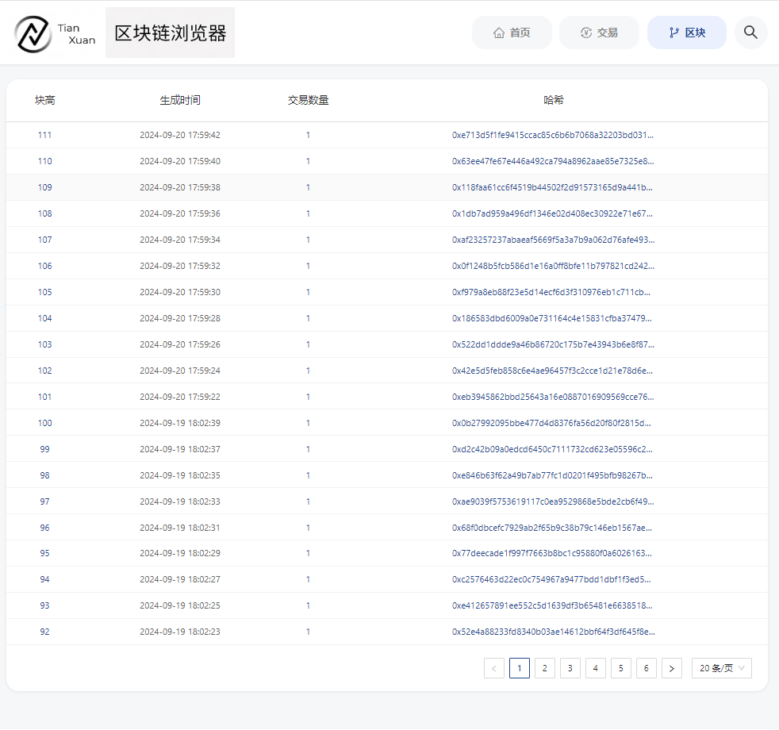
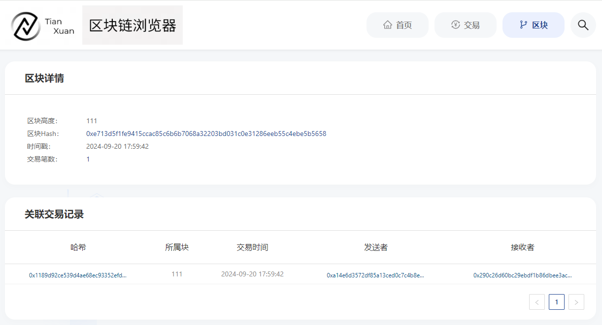
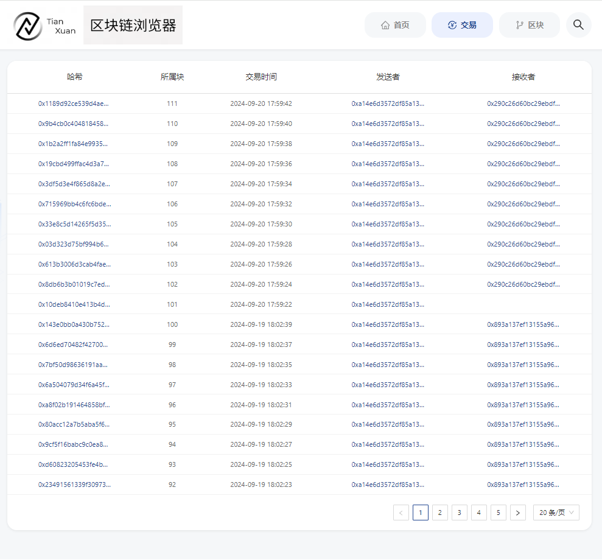

## 1.1.1. 浏览器主要用途

### 1.1.1.1. 基本介绍
区块链浏览器将区块链中的数据可视化，并进行实时展示。方便用户以Web页面的方式，获取当前区块链中的信息。

    <figure style="display: inline-block; margin: 0;">
        
        <figcaption style="text-align: center; max-width: 600px; font-weight: bold; font-size: 14px; color: #555;">区块链浏览器</figcaption>
    </figure>

### 1.1.1.2. 主要功能模块
本小节概要介绍浏览器的各个模块，方便大家对浏览器有一个整体的认识。区块链浏览器主要的功能模块为区块链信息展示。

**区块链信息展示模块**

区块链浏览器主要展示了链上的具体信息，这些信息包括：概览信息，区块信息，交易信息。

    <figure style="display: inline-block; margin: 0;">
        
        <figcaption style="text-align: center; max-width: 600px; font-weight: bold; font-size: 14px; color: #555;">区块链信息展示模块</figcaption>
    </figure>

## 1.1.2. 使用前提
### 1.1.2.1. 天玄链搭建
区块链浏览器展示的数据是从区块链上同步下来的。为了同步数据需要初始化配置，故在同步数据展示前需要用户先搭建好区块链节点。具体搭建流程参见[快速搭建天玄链](../../quick-start/depoly-tianxaun-chain/README.md)。

## 1.1.3. 区块链浏览器搭建
区块链浏览器分为两个部分：后台服务thanos-browser-backend、前端web页面thanos-browser-frontend。

**后台服务搭建**

区块链浏览器后台服务使用Spring Boot的JAVA后台服务，具体搭建流程参见[浏览器后端安装文档](./backend.md)。

**前端web页面服务搭建**

区块链浏览器前端web页面使用框架react，具体搭建流程参见[浏览器前端安装文档](./frontend.md)。

## 1.1.4. 界面展示

### 1.1.4.1. 首页

**概览信息**

主要包括当前块高，交易总量，当前epoch。

**最近14天交易走势**

用折线图的形式展示了当前14天内的交易情况。

**区块概览**

区块概览展示了最近五个区块的信息，包括每个区块的块高，区块hash，块产生的时间及块上的交易总量。

**交易概览**

交易概览展示了最近五个交易，包括交易hash，交易时间，交易的发送者、交易的接收者

    <figure style="display: inline-block; margin: 0;">
        
        <figcaption style="text-align: center; max-width: 600px; font-weight: bold; font-size: 14px; color: #555;">区块链浏览器</figcaption>
    </figure>

### 1.1.4.2. 区块信息浏览
区块信息浏览主要包括区块列表页面和区块详情页面。

    <figure style="display: inline-block; margin: 0;">
        
        <figcaption style="text-align: center; max-width: 600px; font-weight: bold; font-size: 14px; color: #555;">区块列表</figcaption>
    </figure>

    <figure style="display: inline-block; margin: 0;">
        
        <figcaption style="text-align: center; max-width: 600px; font-weight: bold; font-size: 14px; color: #555;">区块详情</figcaption>
    </figure>

### 1.1.4.3. 交易信息浏览
交易信息浏览主要包括交易列表页面和交易详情页面。

    <figure style="display: inline-block; margin: 0;">
        
        <figcaption style="text-align: center; max-width: 600px; font-weight: bold; font-size: 14px; color: #555;">交易列表</figcaption>
    </figure>

    <figure style="display: inline-block; margin: 0;">
        
        <figcaption style="text-align: center; max-width: 600px; font-weight: bold; font-size: 14px; color: #555;">交易详情</figcaption>
    </figure>

